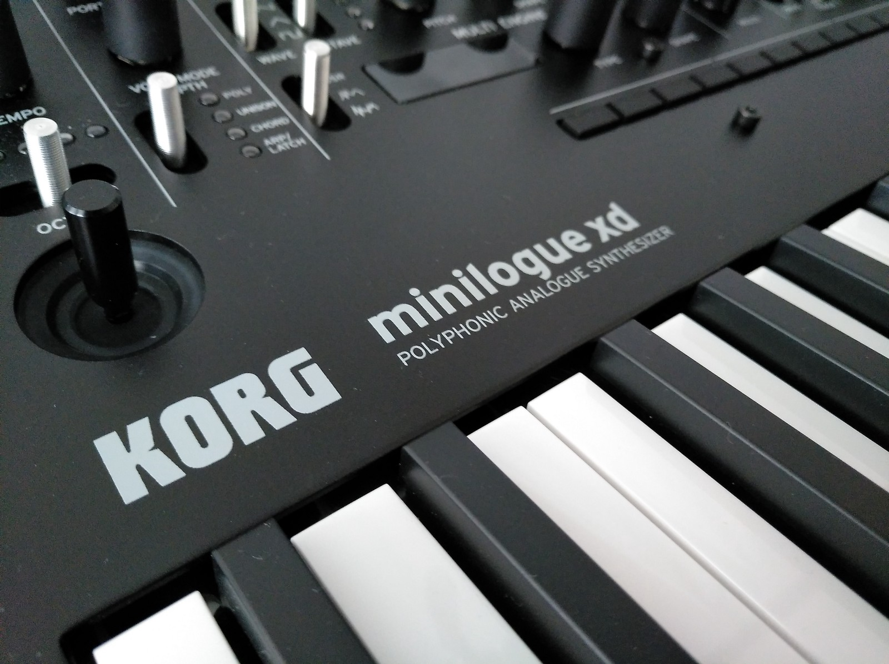

---
author:
  name: OIHAC
  email: meow@onceihadacat.com
description: 'Want to hear all the 200 programs which come together pre-installed on the minilogue xd? then this page is for you.'
keywords: ["minilogue xd", "korg", "synthesizer", "minilogue"]
aliases: ['korg-minilogue-xd-all-presets/', 'minilogue-xd-presets/']
modified: 2019-05-01
published: 2019-05-01
title: KORG minilogue xd | All presets
image: /thoughts/all-presets-of-minilogue-xd/korg-minilogue-xd.jpeg
---

As you may know from my previous post, I’m a big fan of the minilogue xd from KORG and I am noodling through all the parts of this awesome 4-voice synthesizer. One section which I am really interested in is the effects section of the XD.

## Presets

Lots of talented people like Tomohiro Nakamura, Artemiy Pavlov or Nick Kwas have created 200 presets for the minilogue xd. And there are still 300 free programs for own sounds. And of course you can override the existing 200 programs. Here is the complete list.

1. Replicant xd
1. TyoCityLoop
1. Sharp Fifth
1. Quarra
1. Terror Key
1. PWM Cloud
1. Pump SAW
1. Orchestra xD
1. MirroredBass
1. Mr. Squelch
1. MetalFnkLead
1. Space Clavi
1. VelocityStab
1. Bassblaster
1. Digital Rush
1. OnTheLevel
1. CheeseRoyale
1. BabeWave
1. Pluck VPM
1. Pulsating80s
1. Fifth Kiss
1. Warm Dtn
1. Funky Stab
1. Harp xd
1. Future Pulse
1. Atk&Rel
1. Prolly800mk2
1. Kawaii Chord
1. Creep Lights
1. Trill Synth
1. LapisLazuli
1. Claymate
1. DownStair
1. FallingPluck
1. Rainchild
1. Tape*Sine
1. Mini Moon
1. Petrichor
1. LoFi Strings
1. Signal Key
1. Organ xd
1. Organic Keys
1. K.ORG
1. Soapy EP
1. Logue Lady
1. 90’s EPiano
1. XD Seven
1. Roadz Bell
1. Glocken xd
1. Smart Bell
1. FantaBell
1. GateStepps
1. Gate 4AM
1. 1982theme
1. LukeWarm Pad
1. RiseToPower
1. Eyes Of Owl
1. Nowhere Pad
1. WaveSeq Pad
1. GlasssinePad
1. Angelic Vox
1. Plastic Pad
1. Haunted Pad
1. Gaia Dawn
1. Swollen Pad
1. Xtra Fat
1. Sacred Wall
1. Ring PWM
1. BrightStrngs
1. Square Drone
1. Boombastic
1. Dirty Trappn
1. M.G.Bass
1. Octava Bass
1. PWM Bass
1. Cutie Bass
1. Anchor Bass
1. TriKO Bass
1. Pluck Bass
1. Sharp Teeth
1. Hypno Acid
1. Spike Bass
1. Pure Vintage
1. Tronic Bass
1. Multi Bass
1. Thick Bass
1. FM Dubz
1. Brawl Bass
1. Wire Bass
1. ScreaFM Bass
1. Dirty Pulse
1. Crude Pulse
1. Flat Lead
1. Cheese Lead
1. Classic Lead
1. Waard Lead
1. OrientalLead
1. RingSoloLead
1. Rave Synth
1. Detuned Saw
1. Pressure
1. Vreeeew
1. EvilSyncLead
1. OvrdriveLead
1. Hybrid
1. Hoover Cloud
1. Dense Lead
1. The Blob
1. WaveringLead
1. Message From
1. Joystick!
1. #brew time
1. Duality
1. Cluster 5th
1. Innerstellar
1. xdBassRepeat
1. Cloud Level
1. Beautyvolver
1. Sparkles
1. Trance Vibes
1. Warpeggio
1. LetGo Arp
1. Fat Plucks
1. Alarm&Bottle
1. Deep Flavor
1. Piano Chord
1. Gxyexp Stab
1. Lush m7
1. SpiralNebula
1. Third Code
1. Sirens
1. Halo Pad
1. Antidote
1. Starship
1. Space Acid
1. Late Riser
1. Doppler Pad
1. Disco Callin
1. RuinHitChart
1. Broken Toy
1. PTN Techno1
1. PTN Techno2
1. PTN DubTch
1. PTN Acieeed?
1. PTN Mutant
1. PTN Mellow
1. Game On!
1. 16bt Bass
1. VPM Plant
1. BDSDHHTOM
1. TPL BasicSaw
1. TPL BasicTri
1. TPL BasicSqr 
1. TPL BasicSin 
1. TPL LayerOct 
1. TPL Layer5th 
1. TPL 3sawPoly 
1. TPL 4sawDuo 
1. TPL 8sawMono
1. TPL SyncVCO2
1. TPL RingVCO2
1. TPL XmodVCO2
1. TPL ResoVelo 
1. TPL ShortTom 
1. TPL Sweeping 
1. TPL EG+1shot 
1. TPL PulseWM 
1. TPL VPMmod 
1. TPL TrillLFO 
1. TPL PumpSaw 
1. TPL ChordHit
1. TPL RandArp
1. TPL Repeater
1. TPL PingPong 
1. TPL Downpour 
1. TPL 100%Wet 
1. TPL Doubling 
1. TPL Parroted 
1. TPL PumpNois
1. TPL DownSmpl
1. TPL ThruVCF 
1. TPL 2Sines 
1. TPL Reversed 
1. TPL LongSeq 
1. TPL Strings 
1. TPL Brass 
1. TPL Organ 
1. TPL WahClav 
1. TPL A.EPiano 
1. TPL D.EPiano 
1. TPL A.Bell 
1. TPL D.Bell 
1. TPL SubBass
1. TPL LofiSine
1. TPL MonoDriv
1. TPL RoarVPM
1. TPL Talkie 
1. TPL Kick 
1. TPL Snare 
1. TPL Hats

## All the sounds


