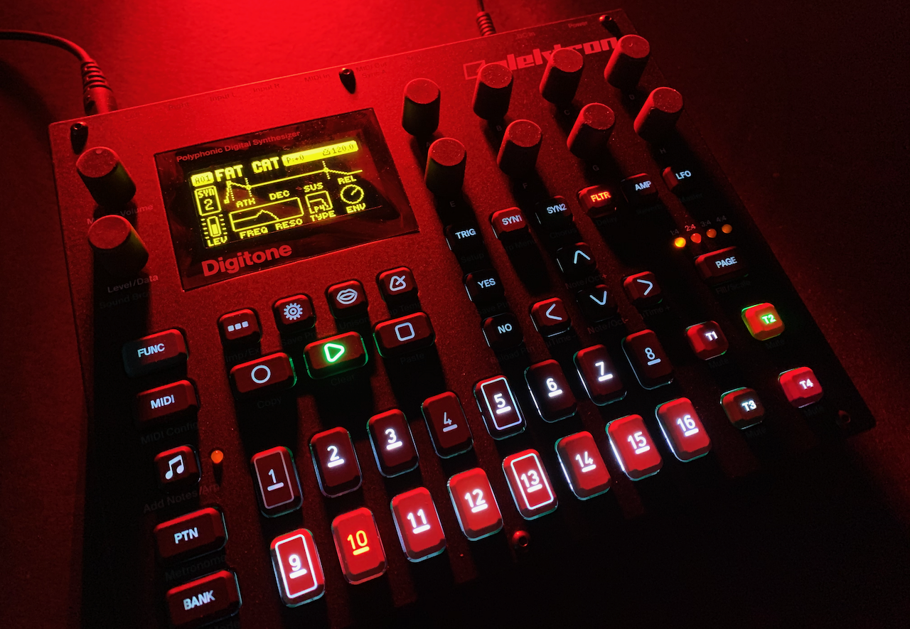
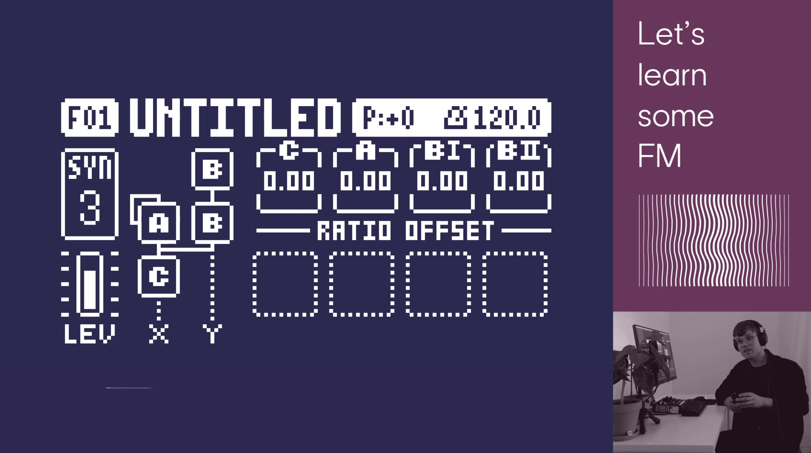
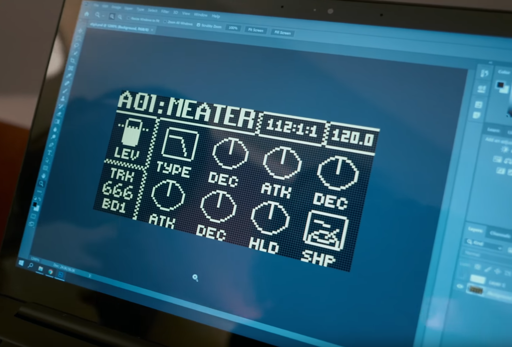

---
author:
  name: OIHAC
  email: meow@onceihadacat.com
description: 'Maybe more than a short summer love. The Digitone by Elektron. What a nicely and well thought out synth.'
keywords: ["elektron", "digitone", "frequency modulation", "FM synthesis", "digital synthesizer"]
aliases: ['']
modified: 2020-07-12
published: 2020-07-12
title: first date -- getting to know the Digitone
image: /thoughts/getting-to-know-the-digitone/digitone-this-thing-is-sexy.png
---

Hell yes. This thing is sexy 🔥 

## The box

I have to confess that I've never owned an [Elektron](https://www.elektron.se/) device before. I was aware of them, but I always thought, that these boxes are more for performers on stage and not for the introverted humans at home. 

How wrong I was. 

I've bought the Digitone.

And not because of all the [mega](https://www.youtube.com/watch?v=1wgUTnBQdZc) and [intense](https://www.youtube.com/watch?v=eZAfh3BYIS8) sales videos from 2018, but because of Elektron's very own [Ess](https://www.instagram.com/ess_mtsn/) and his awesome Twitch stream during 2020s pandemia: https://www.twitch.tv/videos/573170445

This stream and the sounds during it totally transformed me into a fanboy.

## Digitone SySex

The next cool thing I stumbled across were these releases on Bandcamp which included some awesome Sysex files for the Digitone. Example this one: https://0daysysex.bandcamp.com/album/mindmelt.

And another Bandcamp release  -- mainly for the Digitakt -- included some simplified Max patches which seemed to be similar to the early Max prototyypes for the Digitone. See https://0daysysex.bandcamp.com/album/acuate-distress.

## Some insights

And I found this [really nice interview from 2019](https://www.youtube.com/watch?v=fVPaW1s7KVo) which includes some nice insights of the development process which led to the Digitone.

## User Interface

...so after these first 4 days with the Digitone I must say. The User Experience is very nice. Also without the manual I was able to create some nice patterns, projects and sounds. And there is so much more to find out.

Maybe I can add some video with soon, when I've found ~~my cojones~~ some nice FM tunes.