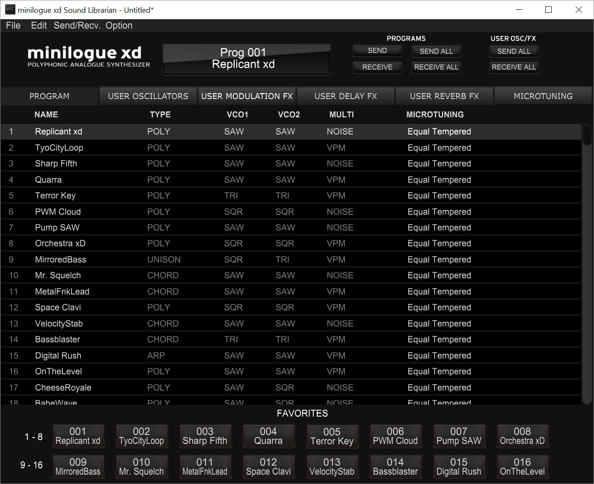
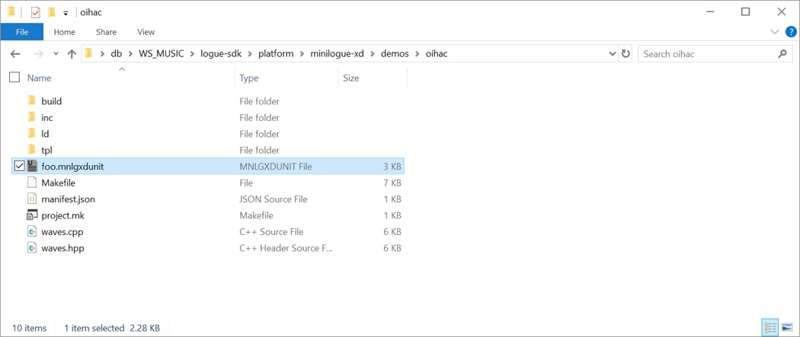
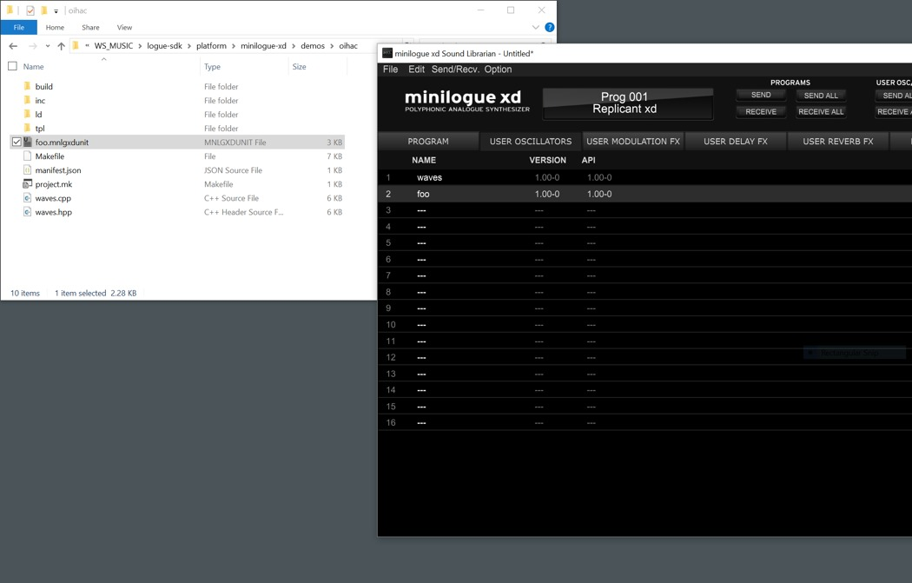
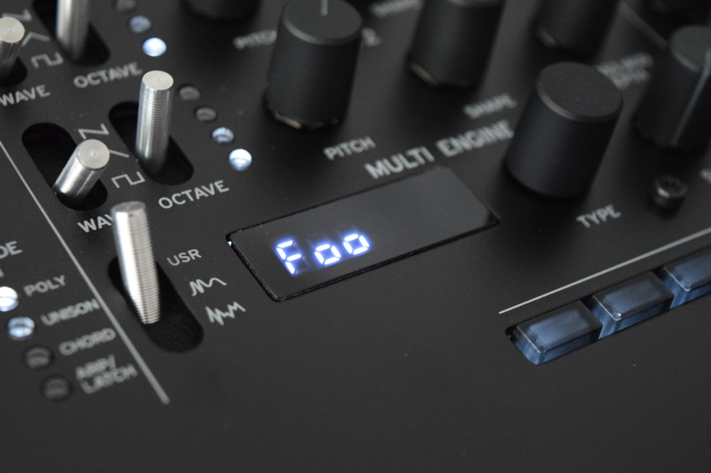

---
author:
  name: OIHAC
  email: meow@onceihadacat.com
description: 'The minilogue xd and the prologue offer the possibility to upload custom oscillators and effects. For this you can use their Sound Librarian app!'
keywords: ["minilogue xd", "korg", "synthesizer", "minilogue", "sound librarian", "prologue", "custom oscilators"]
aliases: ['korg-sound-librarian/', 'minilogue-xd-custom-oscillator-upload']
modified: 2019-05-01
published: 2019-05-01
title: Upload custom oscillators and effects
image: /thoughts/installing-custom-oscillator-minilogue-xd/custom-oscillator-foo-on-minilogue-xd.jpg
---
KORG opened their multi-engine to develop custom oscillators and effects. To upload them you can use their tool Sound Librarian.

## Sound Librarian

KORG provides the users with a small app call Sound Librarian to manage the programs on the minilogue xd and prologue respectively. It is available for Mac and Windows:

- [Sound Librarian minilogue xd page](https://www.korg.com/us/products/synthesizers/minilogue_xd/librarian_contents.php)
- [Sound Librarian prologue page](https://www.korg.com/us/products/synthesizers/prologue/librarian_contents.php)

## Steps to upload a custom oscillator

To upload a custom oscillator and/or effect you need some kind of `.mnlgxdunitt` file, which is a user unit file built using the logue SDK.

KORG already provides us with an example oscillators named 'waves' which is pre-installed and which source code is available in [their repository](https://github.com/korginc/logue-sdk/tree/master/platform/minilogue-xd/demos/waves).

When you have built this, you will get a `waves.mnlgxdunitt` file. In this demonstration I have set the project name to `foo` so we don't get confused. So in this example the final User Unit file is named `foo.mnlgxdunitt`.

This can then be easily dragged and dropped into the Sound Librarian.

After this step you just need to click on `SEND ALL` in the _USER OSC/FX_ section and here we go...

The new user oscillator **foo** is available on the -- in my case -- the minilogue xd.

## Video: How to install an user oscillator on the minilogue xd

_coming soon_
