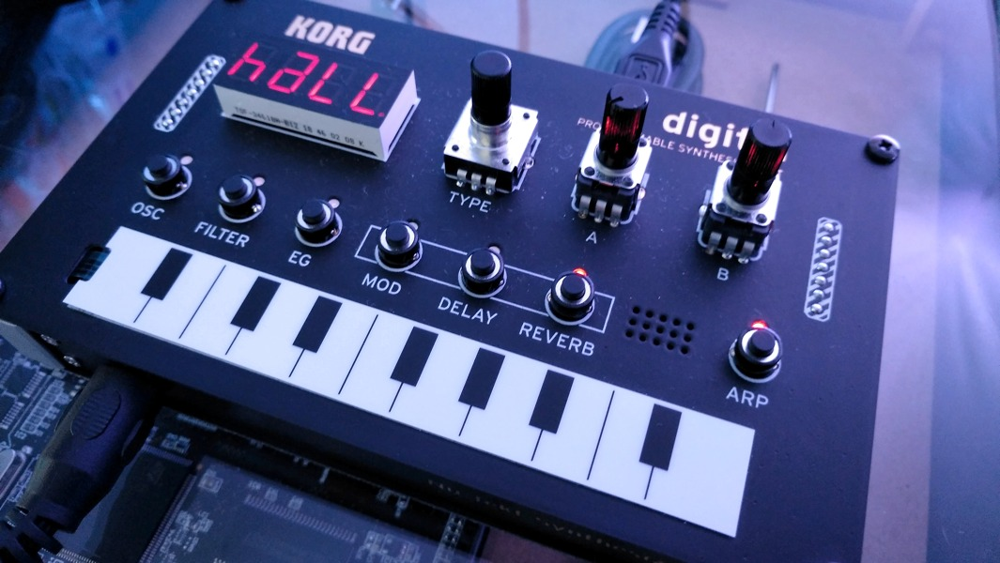
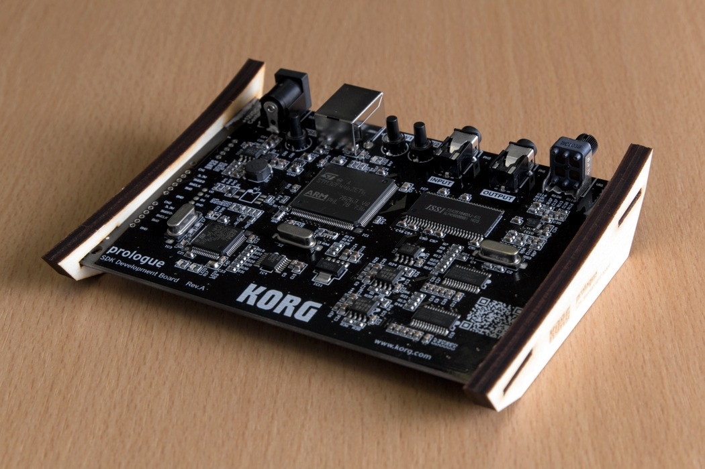

## Nu:Tekt

DIY. After last years super limited development board, KORG presented this year the Nu:Tekt DIY kit. It includes the Multiengine from the prologue and the minilogue xd. So it is possible to use this little box to develop your own oscillators using the [logue sdk](https://github.com/korginc/logue-sdk).

This is the [dev board](https://github.com/korginc/logue-sdk/tree/master/devboards) from last years Superbooth. It was limited:

## minilogue xd desktop

OK, i have an minilogue xd with the keyboard. What makes the desktop version interesting for me, is this polychain functionality to chain my xd together with another xd without a keyboard. But I am not really sure if I really need this. Let's wait for the final price tag. :)

