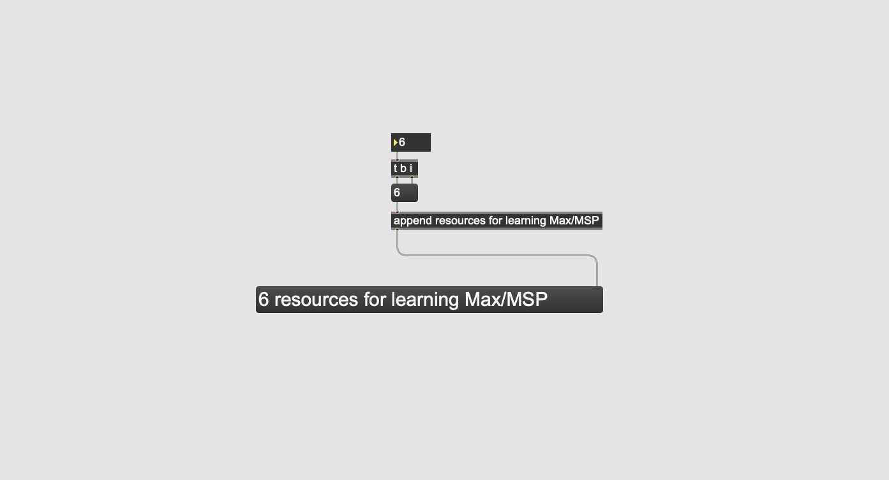

---
author:
  name: OIHAC
  email: meow@onceihadacat.com
description: 'Learning Max/MSP is fun. You can create nearly everything with this neat visual programming language.'
keywords: ["max/msp", "jitter", "gen~", "cycling 74"]
aliases: ['max-msp-resources/']
modified: 2020-04-12
published: 2020-04-01
title: Resources for learning Max/MSP
image: /thoughts/learning-max-msp-gen/title-patch.png
---

Once I had a cat.. and now I have Cycling74's Max. Which is nice. It's a visual programming language which is mainly 
used for audio visual applications. It is wonderful for prototyping as well.

But where to start? Because Max is around for decades there are tons of resources. I try to list the ones I really
like and don't want to forget.

## Courses / Books

If you want the whole package of information. This complete Video courses and books are a good starting point.

## [Programming Max: Structuring Interactive Software for Digital Arts](https://www.kadenze.com/courses/programming-max-structuring-interactive-software-for-digital-arts-i/info)

If you want a structured introductory course to Max/MSP/Jitter this one is for you. Mainly targeted to beginners,
but provides all the information you need to start working with Max. Provided by Kadenze and completely free. And
your tutor is the incredible Matthew Wright.

### [Electronic Music and Sound Design](https://www.amazon.com/Electronic-Music-Sound-Design-Practice/dp/8899212104)

Already in the 4th edition. It provides a really deep view into Max and also into sound design in general. Lots of theory.

### [Step by Step: Adventures in Sequencing with Max/MSP](https://www.amazon.com/Step-Adventures-Sequencing-Max-MSP/dp/1732590303)

## Video Content

There are lots of people providing useful Max information. Here are some which I really like.

### [Max/MSP Livestreams with Tom Hall](https://tomhall.com.au/maxmsp/livestream/)

Cycling's terrific content producer Tom Hall just started a live stream with Max tutorials. Great! #1 was already a highlight.

## Documentation / References

### [Max Cookbook](https://music.arts.uci.edu/dobrian/maxcookbook/node/56)

### [Official Max8 Documentation](https://docs.cycling74.com/max8)

Especially the [tutorial section](https://docs.cycling74.com/max8/tutorials/00_maxindex) is very useful to start with.

