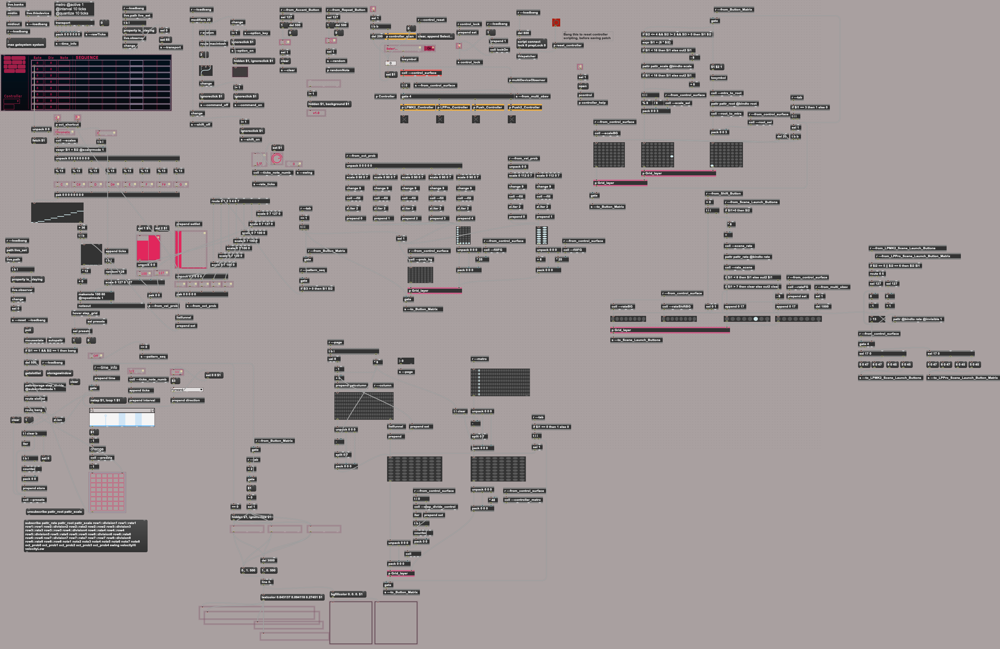
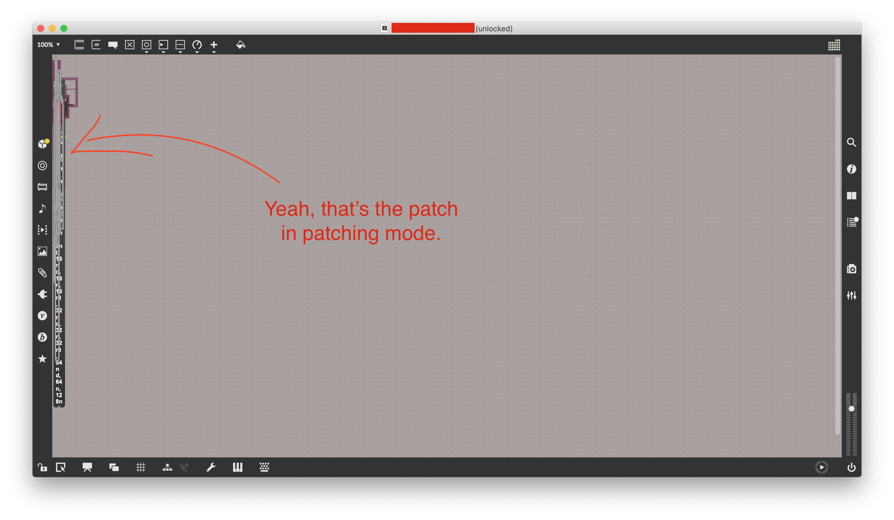

---
author:
  name: OIHAC
  email: meow@onceihadacat.com
description: 'What I always love about Max is its openness. You can always take a look onto a patchs guts. What a pity if the guts look like dump of old spaghetti.'
keywords: ["max/msp", "cycling 74", "obfuscate"]
aliases: ['obfuscate-max-patch/']
modified: 2020-05-07
published: 2020-05-07
title: Frustration through obfuscation in Max/MSP
image: thoughts/max-msp-patch-obfuscation/beauty-of-step-divider-max-patch.png
---

ooh, aah ... what a beauty, what an elegance. 

These are often my first thoughts, when I take a look onto a nicely structured Max/MSP patch. In the above case its the _Step Divider_ patch from the [Probability Pack](https://www.ableton.com/en/packs/probability-pack/) of [Sonic Faction](https://www.facebook.com/SonicFaction/).

But what if your patching view looks like this:

## Open and visual

Lately I really felt in love with Max/MSP. Especially its openness attracts me. You can learn and see how things are done and can even tweak existing patches/devices. 

And with _Max for Live_ you can have it all smoothly integrated into Ableton Live.

And it's visual. This allows grouping of related objects together and see their connections to get a even better understanding.

Thats why I often prefer Max4Live devices in Ableton to normal Plugins. They allow me to get this deeper understanding. And to get this I am of course also willing to pay money. Be it over the [Ableton market place for Max for Live devices](https://www.ableton.com/en/packs/#?item_type=max_for_live) or services like Gumroad.

But there was a disappointment lately. 😿

## Patch Obfuscation

Code obfuscation. I don't like it. Unthinkable in open source projects, where your code commits are some kind of "business card" of yourself and your skills. You want a code that is easy to understand, easy to test, easy to maintain and easy to extend by other people.

And for me Max/MSP patches feel open source like. When I see patches which are structured and nicely arranged I gain trust in it's developer/creator. And I love to use these patches, because they feel and look stable and nice.

But not this time. I paid couple of Euros to download a sequencer Max4Live device from Gumroad. It looked awesome in the presentation view, but when I unlocked it and opened the patching view all my anticipation --- was gone.

It looked like crap. As you can see in the above screenshot.

First I thought its a bug in Max, but when I opened the `amxd` file and took a look on the JSON objects I saw that lots of `patching_rect` properties contain the same position information.

🙀 Everything was overlapping ... on purpose.

## Simon says: "Everybody avoid distancing and jump on each other!"

All the semantic which is normaly stored in the positioning of the objects was gone. One of the biggest benefits of Max. What a pity.

When I searched the holy web for information about this, I found [this old thread in the Cycling74 forum](https://cycling74.com/forums/stand-alone-copy-protection) and I saw that there is this obfuscation method of sending every object a re-positioning message.


this.patcher.apply(eachobj);

function eachobj(x) {
    if (x.maxclass != "patcher") {
        x.message("sendbox","patching_position",100,100);
    }            
    return true;
}


Oh man. 

## Order matters

Right-to-Left order is important in Max. 



Anyway it is not best practice to purely count on the position of objects in the view to have the correct order of signal flow.

But if you do the above code will obsiously destroy of the correct signal flow. 

You should always use the [trigger object](https://docs.cycling74.com/max8/refpages/trigger) instead to keep the correct flow also in case of re-arrangement of the objects.

## Put them back

So what can you do to re-arrange the objects perfectly back if you have been provided such a obfuscated patch?

Of course you could manually move everything around. This would take maybe hours depending on the size of the patch.

A completely automation of restore the original arrangement is not possible, because all the original positions are not stored in the patch file.

One possible helper and starting point could be the above mentioned [patcher object](https://docs.cycling74.com/max8/vignettes/jspatcherobject). Instead of putting all objects together we can spread them some randomly over the canvas.


this.patcher.apply(eachobj);
function eachobj(x)
{
    var x_pos = Math.floor(Math.random() * 1000) + 1;
    var y_pos = Math.floor(Math.random() * 800) + 1;
    x.message("sendbox","patching_rect",x_pos, y_pos, 190, 30);
    return true;
}


In this case we resize all objects to width `190` and height `30` and place them on the canvas with `x` position beween `1` and `1000` and `y` position between `1` and `800`.

Not perfect, but at least we save some time to unravel the obfuscated objects.

So execute the above Javascript code in a patch you can use the `js` object, send it the message `open` and edit your code here. When saved its immediately executed on the patch.

Be aware: Changes done with Javascript can not be undone. 



Not optimal, but maybe a start.

## Trust

I understand the intention of the developer who obfuscated this patch. He or her wants to "protect" their patch, their ideas or whatsoever. But in the end I think Max is such a great tool, because you can share your ideas etc.

And if you want to protect all the code, you can use other languages like C++ to create a normal VST plugin.

When I pay for a Max for Live device or a standard Max patch, I don't like the idea of just getting a nice presentation mode view, but a messy patch mode view. I am interested in this patch and its guts. 😻