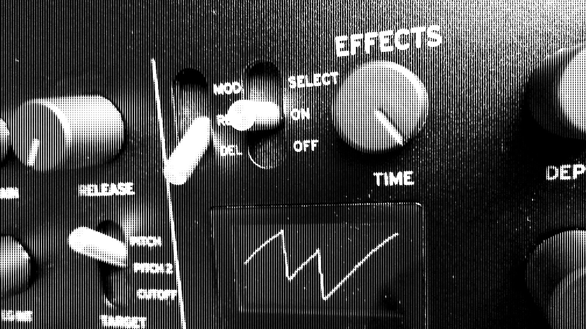

---
author:
  name: OIHAC
  email: meow@onceihadacat.com
description: 'Reverb, Delay, Modulation and custom effects. The XD is full of awesome digital effects. get your ears ready!'
keywords: ["minilogue xd", "korg", "synthesizer", "minilogue", "effects", "reverb", "delay", "modulation"]
aliases: ['korg-minilogue-xd-effects/', 'minilogue-effects-section/']
modified: 2019-05-04
published: 2019-05-04
title: KORG xd | The effects section
image: /thoughts/minilogue-xd-effects-section/minilogue-xd-effects.jpeg
---

I had the pleasure to get my hands on the new synthesizer of #KORG — the incredible cool minilogue xd. What a great sounding and affordable synth. I immediately fell in synth-love with it.

## The effects section

The xd effects section contains 2 switches and 2 knobs. With the first switch you can select which of the digital effect types you want to select: Delay (DEL), Reverb (REV) and Modulation (MOD).

The second switch is there to navigate through the sub-types of the effects.

## DELAY effect type

There are 12 sub-types for the delay effect:

1. **Stereo**: A stereo delay with an expansive left-right field.
1. **Mono**: A straight monaural delay.
1. **Ping Pong**: A ping-pong delay that bounces back and forth from left to right.
1  **Hipass**: A delay with a high-pass filter on which the low frequency band fades out.
1. **Tape**: Simulates a tape echo.
1. **One Tap**: A delay without feedback, on which the delay sounds only once.
1. **Stereo BPM**: A stereo delay on which the delay time is synced to the TEM- PO button settings.
1. **Mono BPM**: A monaural delay on which the delay time is synced to the TEMPO button settings.
1. **Ping BPM**: A ping-pong delay on which the delay time is synced to the TEMPO button settings.
1. **Hipass BPM**: A high-pass delay on which the delay time is synced to the TEMPO button settings.
1. **Tape BPM**: A tape echo on which the delay time is synced to the TEMPO button settings.
1. **Doubling**: A short delay with a doubling effect.

## REVERB effect type

The reverb effect comes with a total of 10 sub-types:

1. **Hall**: A hall-type reverb that simulates the reverberations of a mid- size concert hall or ensemble hall.
1. **Smooth**: A clear reverb with a sustaining high end.
1. **Arena**: A reverb that evokes the feeling of a spacious area like a stadium.
1. **Plate**: A warm-sounding (wet) plate reverb.
1. **Room**: A reverb that simulates the reverberations of a small room.
1. **Early Ref**: A reverb that emphasizes the brighter initial reflections than the lingering echoes.
1. **Space**: An unstable reverb reminiscent of being in space.
1. **Riser**: A shimmering reverb that echoes one octave higher.
1. **Submarine**: A deep reverb that echoes one octave lower.
1. **Horror**: A reverb with a highly unstable tonal quality.

## MODULATION effect type

The MOD section can be switched between the 4 installed types

1. **Chorus**
1. **Ensemble**
1. **Phaser** and
1. **Flanger**

Additionally you can install User effect type.

Each type comes with some sub-types, which can be selected when holding the SHIFT Button and switching the SELECT switch.

### Chorus sub-types

1. **Stereo**: A stereo chorus effect that varies the input signal to create a thicker or warmer sound.
1. **Light**: A chorus effect with lighter modulation than the stereo type.
1. **Deep**: A chorus effect with heavier modulation than the stereo type.
1. **Triphase**: An effect with three choruses, each with different LFO phases.
1. **Harmonic**: A chorus with slightly emphasized overtones.
1. **Mono**: A monaural chorus.
1. **Feedback**: A chorus that uses feedback to create an effect similar to a short delay.
1. **Vibrato**: Produces a vibrato (wavering) effect.

### Ensemble sub-types

1. **Stereo**: An LFO-driven effect with an intricate wavering sound. Pro- duces a spatially deep and expansive ensemble effect.
1. **Light**: An ensemble effect with lighter vibrato than the stereo type.
1. **Mono**: A monaural ensemble effect.

### Phaser sub-types

1. **Stereo**: Alters the phase of the sound to give the sound a swelling effect.
1. **Fast**: A phaser effect that swells faster than the stereo type.
1. **Orange**: An effect that models a popular analog phaser in an orange box.
1. **Small**: An effect that models the classic New York phaser sound from the 1970s.
1. **Small Reso**: A small-type phaser sound with strong peak components.
1. **Black**: An effect modeled after the phaser sounds from Denmark with a wide dynamic range.
1. **Formant**: A phaser derived from the sound of the human voice.
1. **Twinkle**: A phaser that creates a twinkling (sparkly) sound.

### Flanger sub-types

1. **Stereo**: An effect that creates a thick swelling sound and a sense of motion in pitch.
1. **Light**: A flanger with a thinner effect than the stereo type.
1. **Mono**: A monaural flanger.
1. **High Sweep**: A flanger that sweeps through the high-frequency bands.
1. **Mid Sweep**: A flanger that sweeps through the mid-frequency bands.
1. **Pan Sweep**: A flanger that pans from left to right.
1. **Mono Sweep**: A monaural sweeping flanger.
1. **Triphase**: A flanger featuring the effect of three LFOs.

## Video



All the descriptions taken from the [xd manual](https://www.korg.com/us/support/download/product/0/811/)