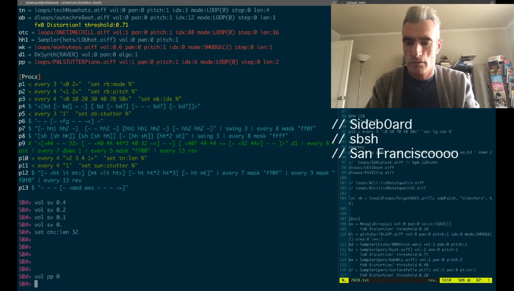
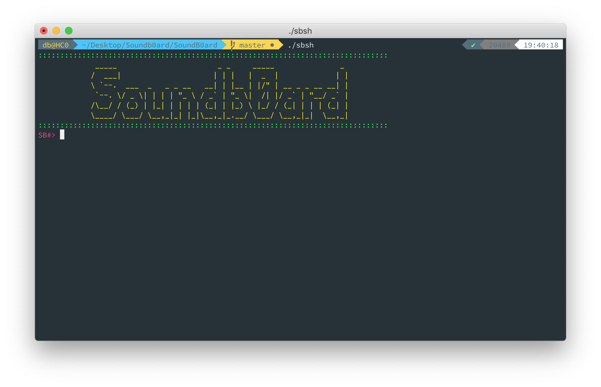

---
author:
  name: OIHAC
  email: meow@onceihadacat.com
description: Soundb0ard. A nify live coding environment written in C/C++.
keywords: ["soundb0ard", "live coding"]
aliases: []
modified: 2020-05-15
published: 2020-05-15
title: making music in the shell -- with Soundb0ard
image: thoughts/trying-soundb0ard/soundb0ard-header.jpg
---

Damn. What a rabbit hole! Live Coding. I've never been into this too much in the past, but currently I have read 
[this nice interview from Cycling74 with Thorsten Sideboard](https://cycling74.com/articles/an-interview-with-thorsten-sideboard-algorithmic-art-assembly).

...and then I stumbled across [this video](https://www.youtube.com/watch?v=wNFlijArs2g) of him. Hell yes, what a cool dude!



...and an awesome performance with his handcrafted live coding platform [Soundb0ard](https://github.com/sideb0ard/SoundB0ard). A treasure and all open-source. 🔥

I wanted to try it out immediately. Here are my steps. 

# Building and running Soundb0ard

## First clone

`git clone git@github.com:sideb0ard/SoundB0ard.git`

My steps on my Mac OS system were:

## Install some libraries

### PortAudio

http://www.portaudio.com/download.html

`./configure --disable-mac-universal && make`

`make install`

This is the only library I installed without using brew. I thought this would be fun, but brew is so much less pain:

`brew install portaudio`

### PortMidi

http://portmedia.sourceforge.net/portmidi/

`brew install portmidi`

### libsndfile

http://www.mega-nerd.com/libsndfile/

`brew install libsndfile`

### ctags

http://ctags.sourceforge.net/

`brew install ctags`

### cscope

http://cscope.sourceforge.net/

`brew install cscope`

### liblo

http://liblo.sourceforge.net/

`brew install liblo`

### readline

`brew install readline`

### Ableton Link

Clone Link from https://github.com/ableton/link



git clone git@github.com:Ableton/link.git
cd link
git submodule update --init --recursive



### Range-v3

https://github.com/ericniebler/range-v3

### Googletest

https://github.com/google/googletest

### Google Performance Tools

https://github.com/gperftools/gperftools

`brew install gperftools`

## Update the Makefile 

There are some path settings which needs to be changed in the `Makefile`.



ABLETONASIOINCDIR=${HOME}/CODE/LIBS/link/modules/asio-standalone/asio/include
READLINEINCDIR=/usr/local/Cellar/readline/8.0.1/include
RANGE3INCDIR=${HOME}/CODE/LIBS/range-v3/include
HOMEBREWINCDIR=${HOME}/homebrew/include

GTEST_DIR =  ${HOME}/CODE/LIBS/googletest/googletest
INCDIRS=-I/usr/local/include \
		-Iinclude \
		-I${HOME}/CODE/LIBS/link/include \
		-I${HOMEBREWINCDIR} \
		-I${RANGE3INCDIR} \
		-I${ABLETONASIOINCDIR} \
		-I${READLINEINCDIR}

HOMEBREWLIBDIR=${HOME}/homebrew/lib
READLINELIBDIR=${HOME}/homebrew/opt/readline/lib

LIBDIRS=-L/usr/local/lib -L${HOMEBREWLIBDIR} -L${READLINELIBDIR}



These are of course specific to my current system.

## make it

...and then a simple `make` is enough to build the application.

```
$ make
$ Boom! make some noise...
```

Good point. Lets try it out.

# How to play with it

You can start the shell by running `./sbsh` from the command line and you are presented a nice colorful intro screen:




I want to collect some infos about the commands and keyboard shortcuts. I haven't found a full documentation yet, but try to figure some stuff by playing around.

**WORK IN PROGRESS**


## keyboard shortcuts

-  +  : Exit soundb0ard shell

## shell commands

- `ps` : show running processes with instruments and algorithms
- `ls` : list samples in `wavs/` folder

## Looping a sample


let l1 = loop(loops/VEH4-24.wav);
set l1:len 4;


`VEH4-24.wav` is in this case a wav file I put into the `wavs/loops/` folder.

## Setting BPM


bpm 128


## Loading and playing a sample

Trying to play a simple kick.


let s1 = sample(kicks/kick8.aif);


Play it using a _pattern_


p1 $ "s1 s1 s1 s1"


it seems that you can have up to `99` pattern (`p1` - `p99`).

## Adding effects to a loop



let l1 = loop(loops/VE4-24.wav)
addFx(l1, "reverb")



With `addFx` you can add couple of effects:

- `bitcrush`
- `compressor`
- `delay` (default delay 200ms)
- `filter`
- `reverb`
- `sidechain`
- `moddelay`
- `modfilter`
- `waveshape`

`sidechain` requires a second argument, which defines the trigger signal used for sidechaining (What is sidechaing? See this [nice article by Ableton](https://www.ableton.com/en/blog/sidechain-compression-part-1/)). For example a kick:


let l1 = loop(loops/VE4-24.wav)
let k1 = sample(kicks/kick8.aif)
addFx(l1, "sidechain", k1)



## Set volume of a track

You can set the volume to a track with a value range of `[0.0, 1.0]`


let l1 = loop(loops/VE4-24.wav)
vol l1 0.4



## Modify the looper loops

In the examples above I have used the looper using the `loop` command. 

The looper allows some modifications:

- `active` : `set l1:active 0` to deactivate and `set l1:active 1` to activate
- `pitch`
- `mode`
- `gate_mode`
- `idx`
- `len`
- `scamble`
- `stutter`
- `step`
- `reverse`
- `grain_dur_ms`
- `grains_per_sec`
- `density_dur_sync`
- `quasi_grain_fudge`
- `fill_factor`
- `grain_spray_ms`
- `selection_mode`
- `env_mode`

## The Moog MiniSynth

There is this minisynth included callled `moog`. And there are a bunch of presets already included in the file [moogpresets.dat](https://github.com/sideb0ard/SoundB0ard/blob/master/settings/moogpresets.dat) which can be loaded using `loadPreset`:


let m1 = moog()
loadPreset(m1, "pacman")
p1 $ "m1 m1 m1"


Presets include e.g. 

- `sharpie`
- `wiffle`
- `rumbllrrSQR2`
- `androidDreams`

For a full list take a look on the `.dat` file.

with `#` instead of `$` you can send MIDI notes to the device:


let mo = moog()
loadPreset(mo, "remotev")
p1 # "c3 d4 c3 a3" mo


## Pattern

This is currently the most confusing part on my side.


let k1 = sample(kicks/kick8.aif)
p1 $ "k1 k1 k1"


- `[]` : pattern group
- `<>` : multi step pattern
- `()` : setting [euclidian](http://cgm.cs.mcgill.ca/~godfried/publications/banff.pdf) rhythm e.g. (`(3,8)`, `(5,13)`)
- `$` : prepending this allows you to access values from the `[Env]` environment -- like your loaded samples etc.
- `#` : this allows you to work with values and assign it to a target (e.g. sending MIDI notes to a synth)

***

...only the beginning. Will continue to add more infos when I am ready :)


